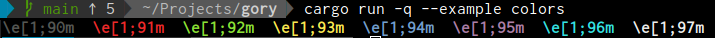

# gory
[](https://opensource.org/licenses/MIT)
[](https://github.com/phR0ze/gory/actions)
[](https://codecov.io/gh/phR0ze/gory)
[](https://crates.io/crates/gory)
[](https://github.com/phR0ze/gory#rustc-requirements)

***Add a little color to the task***

**Example:**  


### Quick links
* [Usage](#usage)
  * [Rustc requirments](#rustc-requirements)
  * [Get String](#get-string)
  * [Control use](#control-use)
* [Contribute](#contribute)
  * [Git-Hook](#git-hook)
* [License](#license)
  * [Contribution](#contribution)
* [Backlog](#backlog)
* [Changelog](#changelog)

## Usage <a name="usage"/></a>

#### Requires rustc >= 1.30 <a name="rustc-requirements"/></a>
This minimum rustc requirement is driven by the enhancemnts made to [Rust's `std::error::Error`
handling improvements](https://doc.rust-lang.org/std/error/trait.Error.html#method.source)

1. Import `gory` into your project via `Cargo.toml`
   ```toml
   [dependencies]
   gory = "0.1"
   ```
2. Use all of `gory` as its simple and tiny
   ```rust
   use gory::*;
   ```
3. Call functions off the default `Colorable` types `String` and `&'static str`
   ```rust
   use gory::*;
   
   fn main() {
       print!("{}  ", format!("\\e[1;{}m", Color::Red).red());
       print!("{}  ", "red".red());
       println!();
   }
   ```

### Get String <a name="get-string"/></a>
To get the wrapped `String` out of a `ColorString` just dereference it.

```rust
use gory::*;

fn main() {
  let cstr = String::from("foo").red();
  assert!(String::from("foo"), *cstr);
}
```

### Control use <a name="control-use"/></a>
Color output can be enabled or disabled using the `TERM_COLOR` varible.

`gory` will automatically detect whether a terminal is attached and if so and `TERM_COLOR` is truthy
or not set it will automatically use color when specified to do so in the code. If `TERM_COLOR` is
set to something falsy color will not be emitted despited an attached tty or use of color functions
in the code.

Additionally however for testing or for other reasons it may be nice to force color to be enabled or
disabled regardless of the presence of a tty or the the env var. This can be done at runtime by
invoking the function `Color::force(val: Option<bool>)` and giving it `true` to force on and `false`
to force off and `None` to return to automatic control.

```rust
use gory::*;

fn main() {
  Color::force(Some(true));
  Color::force(Some(false));
  Color::force(None);
}
```

## Contribute <a name="Contribute"/></a>
Pull requests are always welcome. However understand that they will be evaluated purely on whether
or not the change fits with my goals/ideals for the project.

### Git-Hook <a name="git-hook"/></a>
Enable the git hooks to have automatic version increments
```bash
cd ~/Projects/gory
git config core.hooksPath .githooks
```

## License <a name="license"/></a>
This project is licensed under either of:
 * MIT license [LICENSE-MIT](LICENSE-MIT) or http://opensource.org/licenses/MIT
 * Apache License, Version 2.0 [LICENSE-APACHE](LICENSE-APACHE) or http://www.apache.org/licenses/LICENSE-2.0

### Contribution <a name="contribution"/></a>
Unless you explicitly state otherwise, any contribution intentionally submitted for inclusion in
this project by you, as defined in the Apache-2.0 license, shall be dual licensed as above, without
any additional terms or conditions.

---

## Backlog <a name="backlog"/></a>
* Support more pre-defined colors like `orange`?
* Support styles like `underline`?

## Changelog <a name="changelog"/></a>
* 12/30/2020
  * Corrected the minimum rustc badge and added a description
